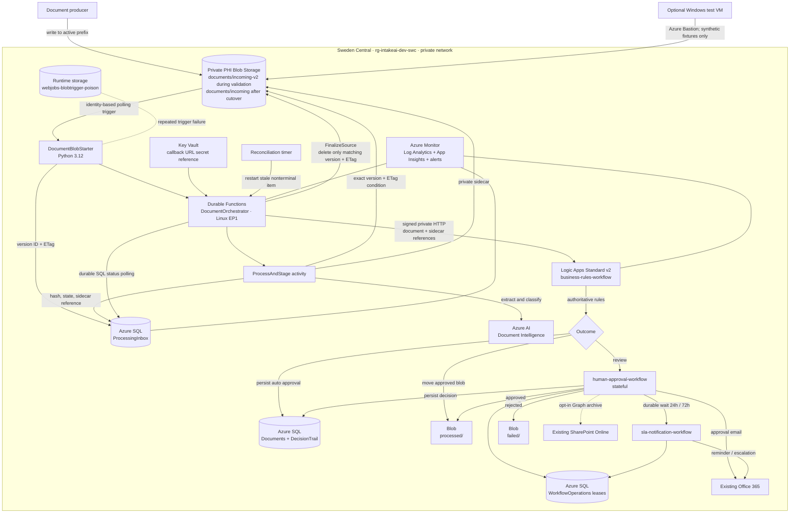

# Architecture Diagram

The deployable architecture is shown below. The editable
`SwedenCentralDeployment.excalidraw`, its PNG export, and this Mermaid view
show the same Python Durable design.

Key properties:

- The Function reads the exact registered blob version under its ETag
  precondition.
- SQL is the durable cross-service state and side-effect lease store.
- The Logic App callback signature is held in Key Vault, not configuration
  source.
- Approval reminder and escalation are durable Logic Apps waits.
- SharePoint and the Bastion-accessed test VM are optional.

See [architecture.md](../architecture.md) for the sequence and
[runbook.md](../runbook.md) for cutover and recovery.
